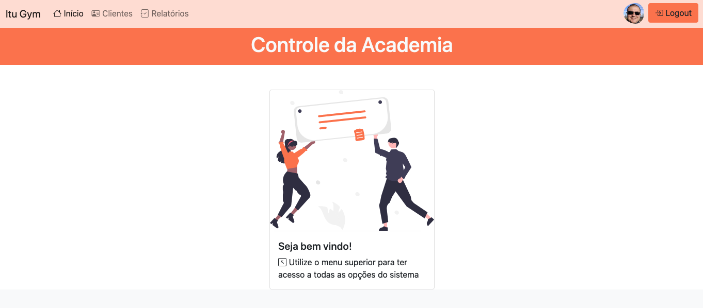

# 🔥 CRUD com autenticação integrado ao Firebase (v.9 SDK) utilizando apenas HTML, CSS e Javascript puro

Projeto em HTML, CSS e Vanilla Javascript que implementa um pequeno CRUD. (São utilizados o Realtime Database, Authentication com email/senha e conta Google e Storage do Firebase)


<p align="center">
<a href="https://github.com/users/ricardoleme/achievements/starstruck" target="_blank">
<br>
<small>This repository has many stars from community.⭐️⭐️⭐️</small>
</p>

<p align="center">
  
<a href="https://fatecitu.edu.br" target="_blank">
  
  </a>
</p>
<p align="center">
  

   

   

   


</p>

# 🧠 Contexto

Uma das dificuldades dos desenvolvedores de é implementar um pequeno CRUD que possua autenticação, sem antes se envolver em um framework web, como o Vue, Angular ou React.
O propósito desse pequeno sistema é mostrar que é possível desenvolvermos uma aplicação 100% na nuvem, utilizando apenas HTML, CSS e Javascript.
## 📋 Instruções

- [ ] Inicialmente clone o projeto; 
- [ ] Acesse https://firebase.google.com e crie um novo projeto Web.
- [ ] Edite o arquivo firebase.js e cole nele as informações de conexão apresentadas pelo Firebase.
- [ ] Acesse _Realtime Database_ e em regras, informe que apenas usuários autenticados terão direito de acesso (escrita e leitura) aos dados:
```json
{
  "rules": {
    ".read": "auth != null",
    ".write": "auth != null"
  }
}
```
- [ ] Acesse _Cloud Firestore_ e em regras, informe que apenas usuários autenticados terão direito de acesso (escrita e leitura) aos dados:
```javascript
​rules_version = '2';
service cloud.firestore {
  match /databases/{database}/documents {
    match /{document=**} {
      allow read, write : if request.auth != null;
    }
  }
}
```

- [ ] Abra o arquivo index.html no seu navegador, crie um novo usuário e navegue pelo seu CRUD! (ou se preferir, instale o [Live Server](https://marketplace.visualstudio.com/items?itemName=ritwickdey.LiveServer) no VS Code, clique com o botão direito dentro do arquivo index.html e selecione Open with Live Server)

## 🌐 Veja uma demonstração online do projeto. 

Utilize a sua conta Google para efetuar o Login, ou cadastre um novo usuário.

https://ricardoleme.github.io/crud-firebase-v9-vanilla-js/

## 📷 Imagens do Projeto

")

")

## 📚 Inspirações
- https://github.com/GCMoura/first-crud-firebase
- https://github.com/ArefinAnwar/todo-crud_firebaseSDK9

## 💬 Contato

Prof. Ms. Ricardo Leme <br>
<a href="https://www.linkedin.com/in/ricardo-leme/" target="_blank">
  
</a>
<a href="mailto:ricardo.leme@fatec.sp.gov.br" target="_blank">
  
</a>

## 📝 Licença

Esse projeto está sob a licença Apache. Veja o arquivo [LICENSE](LICENSE) para mais detalhes.
---
Made with 💜, HTML, CSS and only Vanilla JS. 